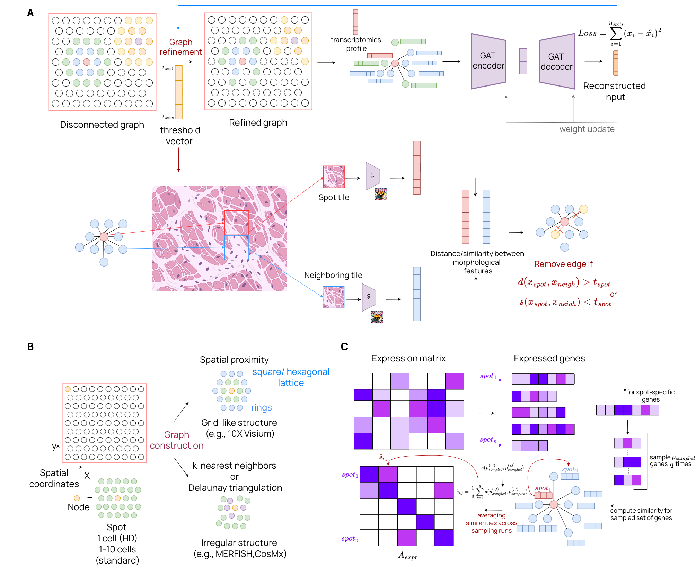

# SpaTIM

Morphologically-aided domain identification and spatial transcriptomics data denoising with SpaTIM. 

# Overview
We introduced SpaTIM, a graph-based deep learning model that integrates gene expression, spatial coordinates, and morphological images to enhance representational learning in spatial transcriptomics. Given a spatial transcriptomics dataset and the paired H\&E images, SpaTIM constructs an initial graph based on spatial proximity and extracts spot-level morphological embeddings from paired images using a digital pathology foundation model. These embeddings are then used to iteratively and adaptively refine the graph structure through the learning of spot-specific similarity thresholds, which prune edges between morphologically dissimilar spots based on cosine similarity. This dynamic graph refinement allows SpaTIM to capture biologically meaningful relationships beyond simple spatial proximity while filtering out uninformative connections. The refined graph is jointly optimized with a graph-based autoencoder, yielding low-dimensional, robust, and spot-specific representations that improve the modeling of spatial tissue organization and various downstream analyses. To accommodate spatial transcriptomics experiments without paired imaging data, we further extend SpaTIM by enabling the construction of a weighted adjacency matrix through a stochastic gene-sampling similarity strategy. This approach mitigates sparsity and noise by repeatedly sampling subsets of expressed genes and aggregating similarity estimates across multiple iterations, leading to a more robust estimate of spot-spot relationships.

<!-- 
 -->